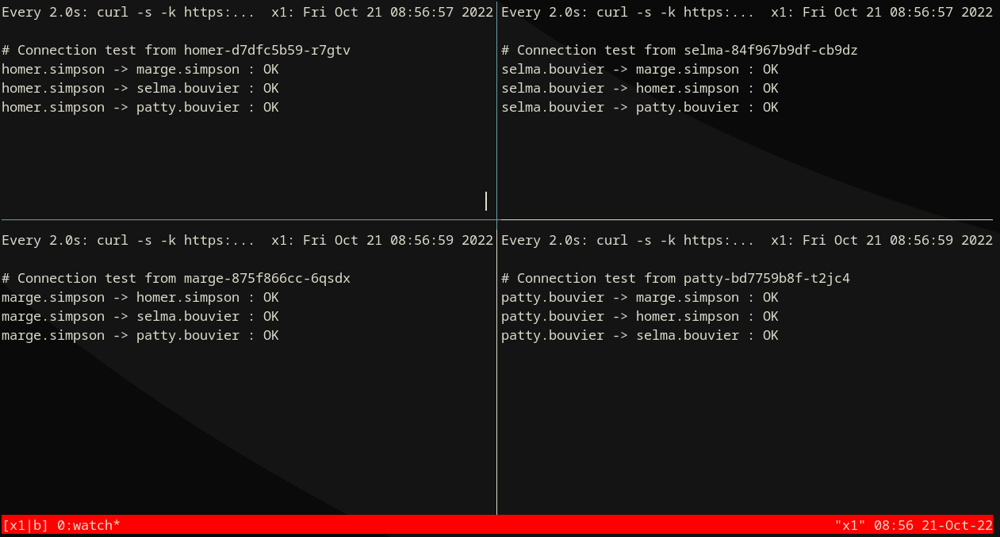
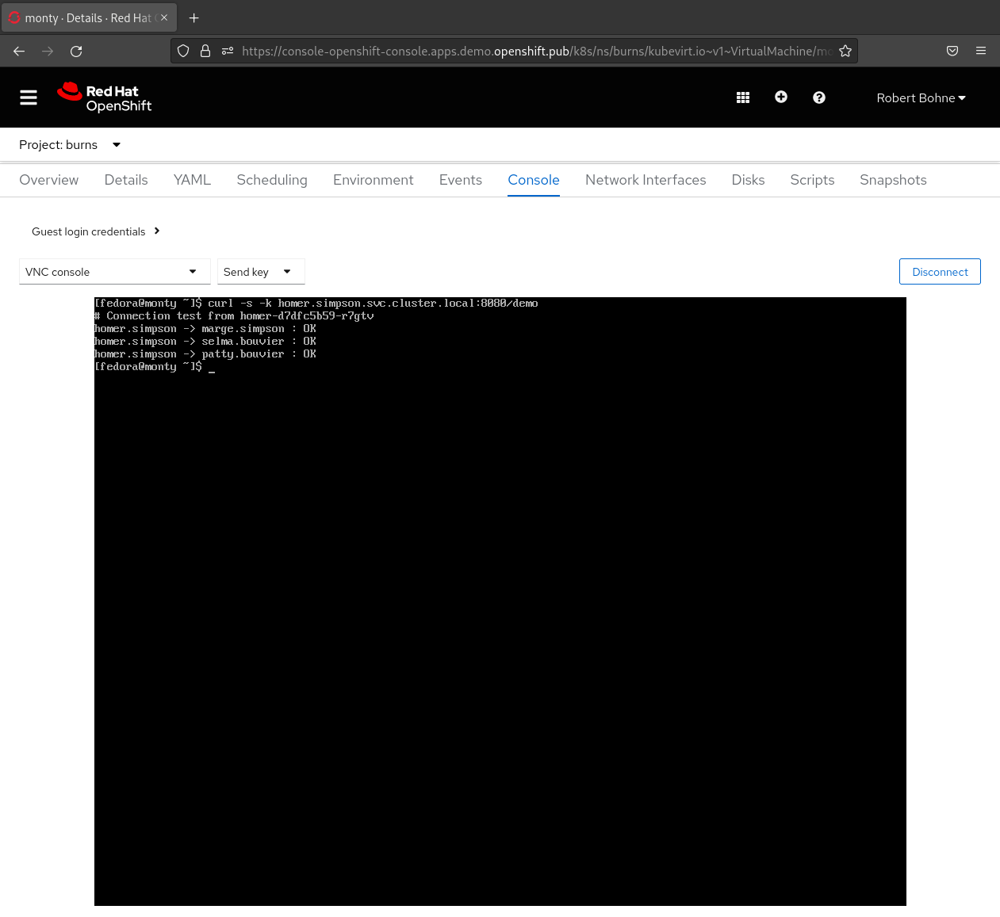

# Network Policy Demo

Official documentation: [About network policy
](https://docs.openshift.com/container-platform/latest/networking/network_policy/about-network-policy.html)


Based on a blog post done here - [Network Policy Demo](https://examples.openshift.pub/networking/network-policy/OpenShiftSDN/​)


## Environment


## Deploy Environment

=== "OC"

```bash
oc apply -k deployment/
```

## Optional: Deploy OpenShift Console samples

      { width="640" }

=== "OC"

```bash
oc apply -f deployment/console-samples.yaml
```

=== "console-samples.yaml"

```yaml
    --8<-- "content/networking/network-policy/network-policy-demo/deployment/console-samples.yaml"
```


## Start Monitor

### Option 1) Local tmux script

```bash
curl -L -O {{ page.canonical_url }}run-tmux.sh

# Get OpenShift Wildcard domain:
WILDCARD_DOMAIN=$( oc get ingresscontroller/default -n openshift-ingress-operator -o jsonpath="{.status.domain}" )


# Start tmux
sh run-tmux.sh $WILDCARD_DOMAIN
```

&nbsp;&nbsp;&nbsp;&nbsp;&nbsp;&nbsp;{ width="640" }

### Option 2) via Pod 

=== "OC"

```bash
oc apply -k deployment/monitor/
```

Watch logs:

```bash
oc logs --tail=1 -f deployment/monitor -n network-policy-demo-monitor
```

## Step 1) Default deny


=== "OC"

```bash
oc apply -f network-policies/01_default-deny-simpson.yaml
```

=== "01_default-deny-simpson.yaml"

```yaml
--8<-- "content/networking/network-policy/network-policy-demo/network-policies/01_default-deny-simpson.yaml"
```


&nbsp;&nbsp;&nbsp;&nbsp;&nbsp;&nbsp;{ width="640" }

## Step 2) Allow ingress


=== "OC"

```bash
oc apply -f network-policies/02_allow-from-openshift-ingress-simpson.yaml
```

=== "network-policies/02_allow-from-openshift-ingress-simpson.yaml"

```yaml
--8<-- "content/networking/network-policy/network-policy-demo/network-policies/02_allow-from-openshift-ingress-simpson.yaml"
```


&nbsp;&nbsp;&nbsp;&nbsp;&nbsp;&nbsp;{ width="640" }


## Step 3) Allow ingress


=== "OC"

```bash
oc apply -f network-policies/03_allow-same-namespace-simpson.yaml
```

=== "network-policies/03_allow-same-namespace-simpson.yaml"

```yaml
--8<-- "content/networking/network-policy/network-policy-demo/network-policies/03_allow-same-namespace-simpson.yaml"
```


&nbsp;&nbsp;&nbsp;&nbsp;&nbsp;&nbsp;{ width="640" }


## Step 4) Allow from Bouviers to Marge Simpson


=== "OC"

```bash
oc apply -f network-policies/04_allow-from-bouviers-to-marge-simpson.yaml
```

=== "network-policies/04_allow-from-bouviers-to-marge-simpson.yaml"

```yaml
--8<-- "content/networking/network-policy/network-policy-demo/network-policies/04_allow-from-bouviers-to-marge-simpson.yaml"
```


&nbsp;&nbsp;&nbsp;&nbsp;&nbsp;&nbsp;{ width="640" }


## Step 5) Allow from Burns to Simpson


=== "OC"

```bash
oc apply -f network-policies/05_allow-from-burns-simpson.yaml
```

=== "network-policies/05_allow-from-burns-simpson.yaml"

```yaml
--8<-- "content/networking/network-policy/network-policy-demo/network-policies/05_allow-from-burns-simpson.yaml"
```


&nbsp;&nbsp;&nbsp;&nbsp;&nbsp;&nbsp;{ width="640" }


