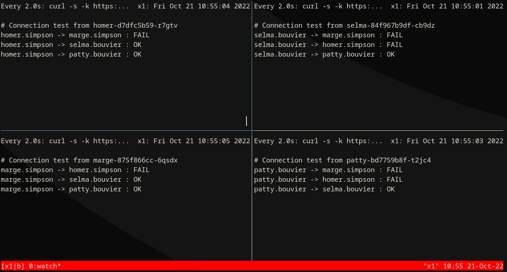

# Network Policy Demo

Official documentation: [About network policy](https://docs.openshift.com/container-platform/latest/networking/network_policy/about-network-policy.html)

Based on a blog post done here - [Network Policy Demo](https://examples.openshift.pub/networking/network-policy/OpenShiftSDN/​)


## Environment


## Prerequisites
```bash
git clone https://github.com/crossvale-inc/ocp-workshop-network-policies
cd ocp-workshop-network-policies
# Enter your username when prompted to create namespaces prefixed with username E.g. chamilton-simpsons, chamilton-bouvier, etc.
./00_prerequisites.sh
```

## Deploy Environment
```bash
# This will deploy the applications for Homer, Marge, Selma, Patty, Monty and Monitor to the prefixed namespaces respectively
./01_start-deployments.sh
```

## Optional: Deploy OpenShift Console samples


```bash
# Optional: This will deploy the Network Policy Samples related to the Simpson Lab.  This is not required to make the lab work.
./01b_deploy-openshift-console-samples.sh
```
## Start Monitoring Logs

### Option 1) via Pod
Watch logs:

```bash
# This will show the logs from the Network Monitor Pod
./02_monitor-deployments.sh
```
<!---
### Option 2) Local tmux script

```bash
curl -L -O {{ page.canonical_url }}run-tmux.sh

# Get OpenShift Wildcard domain:
WILDCARD_DOMAIN=$( oc get ingresscontroller/default -n openshift-ingress-operator -o jsonpath="{.status.domain}" )


# Start tmux
sh run-tmux.sh $WILDCARD_DOMAIN
```

{ width="640" }

--->

## Network Policy - Default Deny Namespaces
```bash
# This will block any traffic to and from namespaces and within namespaces
./03_default-deny-namespaces.sh
```
<!---

--->

<!---
## Network Policy - Allow from Ingress to Simpson Namespace

{ width="640" }
--->

## Network Policy - Allow Same Namespaces
```bash
# This will allow only traffic from the same namespace and block from outside the namespace
./05_allow-same-namespaces.sh
```
<!---
{ width="640" }
--->

## Network Policy - Allow Bouviers Namespace to Marge Simpson Application
```bash
# This will allow only traffic from the Bouviers namespace to the Marge Simpson application in the Simpson namespace
./06_allow-bouviers-to-marge-simpson.sh
```
<!---
{ width="640" }
--->

## Network Policy - Allow Burns Namespace to Simpsons Namespace
```bash
# This will allow traffic from the Burns namespace to the Simpsons namespace
./07_allow-burns-to-simpson.sh
```
<!---
{ width="640" }
--->

## Cleanup the Deployments
```bash
# This will delete the deployments in each of the namespaces, remove any artifacts that were deployed as well as delete any locally generated files
./08_cleanup-deployments.sh
```
